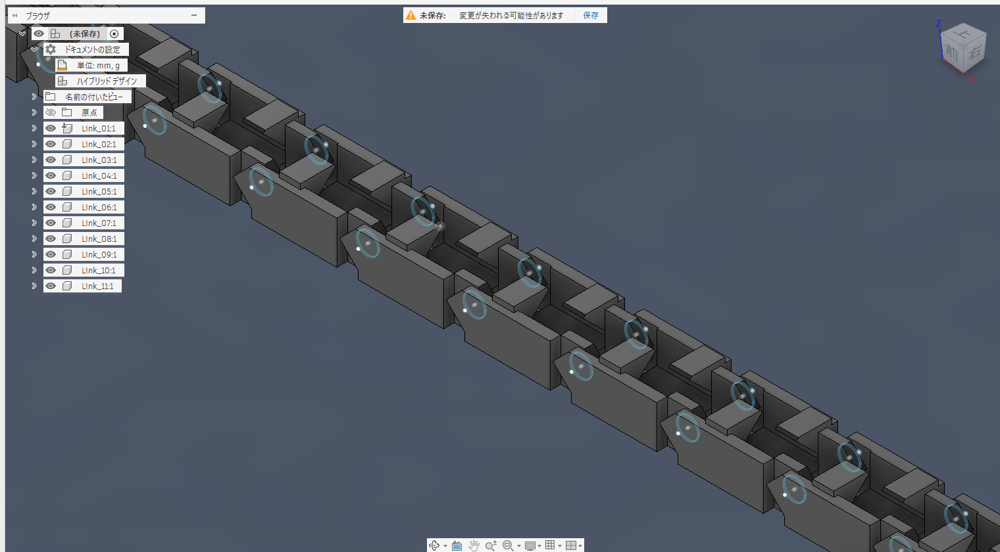
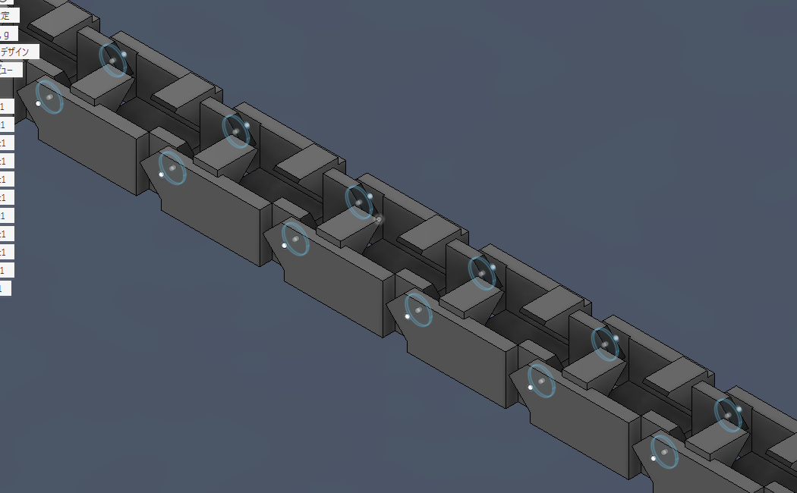
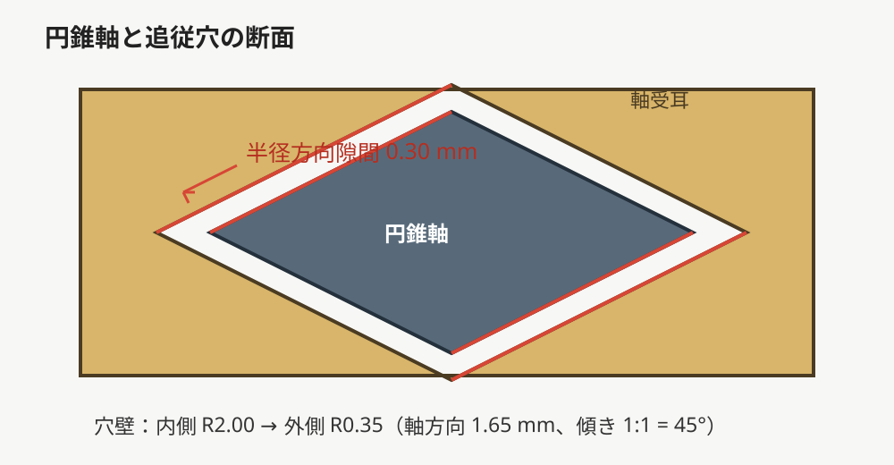

# Fusion Print-in-Place Cable Carrier

[日本語](#日本語) | [English](#english)



## 日本語

Autodesk Fusionで、寸法を指定してPrint-in-Placeケーブルキャリアを生成するアドインです。SG90などの3芯サーボケーブルを想定し、45°形状を利用してサポート材を減らせる構造にしています。

### 主な機能

- 通路幅、通路高さ、ストローク長、1リンクのピッチをUIから指定
- リンク数を`ceil(ストローク長 / リンクピッチ) + 1`で自動計算
- 円錐軸と追従円錐穴の半径方向クリアランス0.30 mm
- ケーブル入口に1×1 mm・45°面取り
- ケーブル保持フック下面と回転逃げを45°で構成
- 生成後は全リンクを1つのプリント用コンポーネントへ整理
- F3DとSTEPを自動出力
- UIは日本語・英語併記、スクロール不要の固定初期サイズ

### インストール

1. このリポジトリをダウンロードまたはcloneします。
2. `SG90_Cable_Carrier_Generator`フォルダ全体を、FusionのユーザーAddInsフォルダへコピーします。

   Windows:

   ```text
   %APPDATA%\Autodesk\Autodesk Fusion 360\API\AddIns\
   ```

3. Fusionを再起動します。
4. ソリッド作業スペースのアドインパネルから「ケーブルキャリア生成 / Cable Carrier Generator」を実行します。

### 入力項目

| 項目 | 初期値 | 条件 |
|---|---:|---|
| 通路幅 / Channel width | 10 mm | 6 mm以上 |
| 通路高さ / Channel height | 6 mm | 幅÷2+0.6 mm以上 |
| 長さ / Stroke length | 200 mm | リンクピッチ以上 |
| 1ブロック / Link pitch | 20 mm | 12 mm以上 |

生成したF3D、STEP、ログは次のフォルダに保存されます。

```text
Documents\SG90_Cable_Carrier_Output\
```

### サンプル

`examples/`には、通路幅10 mm、通路高さ6 mm、ストローク200 mm、ピッチ20 mmで生成したF3DとSTEPを収録しています。





### 使用報告歓迎

造形できた、別サイズで使えた、改善した、といった使用報告を歓迎します。GitHub Issueで気軽に知らせてください。報告は任意で、利用条件ではありません。

### ライセンス

MIT Licenseです。詳しくは[LICENSE](LICENSE)を参照してください。

### 注意

プリンタ、材料、積層条件によって必要なクリアランスは異なります。まず小規模なテスト造形を行い、必要に応じて寸法を調整してください。

## English

An Autodesk Fusion add-in that generates a dimensioned print-in-place cable carrier. It is designed for three-wire servo cables such as the SG90 and uses 45-degree geometry to reduce the need for support material.

### Features

- Set channel width, channel height, stroke length, and link pitch from the UI
- Automatically calculate link count as `ceil(stroke length / link pitch) + 1`
- 0.30 mm radial clearance between conical hinge pins and matching bores
- 1 × 1 mm, 45-degree chamfers at the cable entry
- 45-degree hook undersides and rotational reliefs
- Collect all generated links under one print component
- Automatically export F3D and STEP files
- Bilingual Japanese/English UI with a fixed initial size that avoids scrolling

### Installation

1. Download or clone this repository.
2. Copy the entire `SG90_Cable_Carrier_Generator` folder into your Fusion user AddIns directory.

   Windows:

   ```text
   %APPDATA%\Autodesk\Autodesk Fusion 360\API\AddIns\
   ```

3. Restart Fusion.
4. Run “ケーブルキャリア生成 / Cable Carrier Generator” from the add-ins panel in the Solid workspace.

### Inputs

| Input | Default | Constraint |
|---|---:|---|
| Channel width | 10 mm | At least 6 mm |
| Channel height | 6 mm | At least width ÷ 2 + 0.6 mm |
| Stroke length | 200 mm | At least the link pitch |
| Link pitch | 20 mm | At least 12 mm |

Generated F3D, STEP, and log files are saved to:

```text
Documents\SG90_Cable_Carrier_Output\
```

### Example files

The `examples/` directory contains F3D and STEP files generated with a 10 mm channel width, 6 mm channel height, 200 mm stroke, and 20 mm pitch.

### Usage reports are welcome

Reports about successful prints, alternate dimensions, or improvements are very welcome. Feel free to open a GitHub Issue. Reporting is optional and is not a condition of use.

### License

MIT License. See [LICENSE](LICENSE) for details.

### Print notice

Required clearance depends on the printer, material, and layer settings. Start with a small test print and adjust dimensions when necessary.
